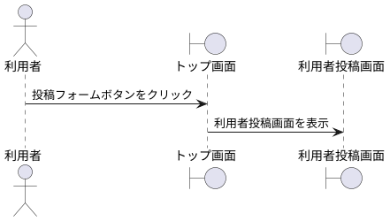
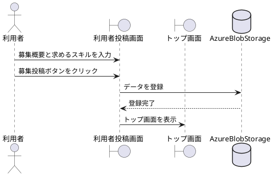
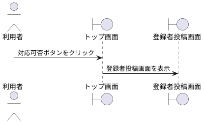
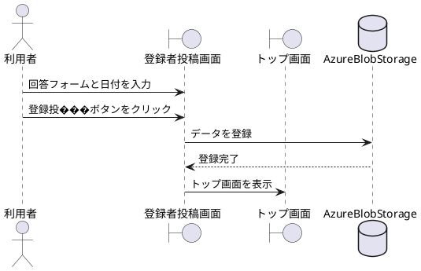
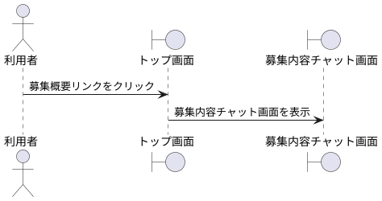
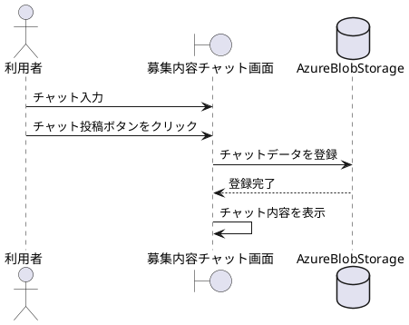

## シーケンス図

### 1. トップ画面から利用者投稿画面への遷移

```plantuml
@startuml
actor 利用者 as User
boundary トップ画面 as TopPage
boundary 利用者投稿画面 as UserPostPage

User -> TopPage : 投稿フォームボタンをクリック
TopPage -> UserPostPage : 利用者投稿画面を表示
@enduml
```

### 2. 利用者投稿画面からトップ画面への遷移

```plantuml
@startuml
actor 利用者 as User
boundary 利用者投稿画面 as UserPostPage
boundary トップ画面 as TopPage
database AzureBlobStorage as AzureBlobStorage

User -> UserPostPage : 募集概要と求めるスキルを入力
User -> UserPostPage : 募集投稿ボタンをクリック
UserPostPage -> AzureBlobStorage : データを登録
AzureBlobStorage --> UserPostPage : 登録完了
UserPostPage -> TopPage : トップ画面を表示
@enduml
```

### 3. トップ画面から登録者投稿画面への遷移

```plantuml
@startuml
actor 利用者 as User
boundary トップ画面 as TopPage
boundary 登録者投稿画面 as RegisterPostPage

User -> TopPage : 対応可否ボタンをクリック
TopPage -> RegisterPostPage : 登録者投稿画面を表示
@enduml
```

### 4. 登録者投稿画面からトップ画面への遷移

```plantuml
@startuml
actor 利用者 as User
boundary 登録者投稿画面 as RegisterPostPage
boundary トップ画面 as TopPage
database AzureBlobStorage as AzureBlobStorage

User -> RegisterPostPage : 回答フォームと日付を入力
User -> RegisterPostPage : 登録投���ボタンをクリック
RegisterPostPage -> AzureBlobStorage : データを登録
AzureBlobStorage --> RegisterPostPage : 登録完了
RegisterPostPage -> TopPage : トップ画面を表示
@enduml
```

### 5. トップ画面から募集内容チャット画面への遷移

```plantuml
@startuml
actor 利用者 as User
boundary トップ画面 as TopPage
boundary 募集内容チャット画面 as ChatPage

User -> TopPage : 募集概要リンクをクリック
TopPage -> ChatPage : 募集内容チャット画面を表示
@enduml
```

### 6. 募集内容チャット画面でのチャット投稿

```plantuml
@startuml
actor 利用者 as User
boundary 募集内容チャット画面 as ChatPage
database AzureBlobStorage as AzureBlobStorage

User -> ChatPage : チャット入力
User -> ChatPage : チャット投稿ボタンをクリック
ChatPage -> AzureBlobStorage : チャットデータを登録
AzureBlobStorage --> ChatPage : 登録完了
ChatPage -> ChatPage : チャット内容を表示
@enduml
```