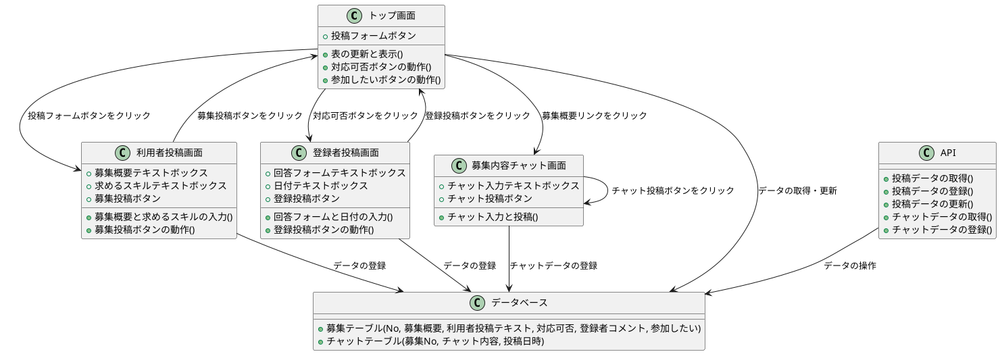

```plantuml
@startuml
class トップ画面 {
    +投稿フォームボタン
    +表の更新と表示()
    +対応可否ボタンの動作()
    +参加したいボタンの動作()
}

class 利用者投稿画面 {
    +募集概要テキストボックス
    +求めるスキルテキストボックス
    +募集投稿ボタン
    +募集概要と求めるスキルの入力()
    +募集投稿ボタンの動作()
}

class 登録者投稿画面 {
    +回答フォームテキストボックス
    +日付テキストボックス
    +登録投稿ボタン
    +回答フォームと日付の入力()
    +登録投稿ボタンの動作()
}

class 募集内容チャット画面 {
    +チャット入力テキストボックス
    +チャット投稿ボタン
    +チャット入力と投稿()
}

class データベース {
    +募集テーブル(No, 募集概要, 利用者投稿テキスト, 対応可否, 登録者コメント, 参加したい)
    +チャットテーブル(募集No, チャット内容, 投稿日時)
}

class API {
    +投稿データの取得()
    +投稿データの登録()
    +投稿データの更新()
    +チャットデータの取得()
    +チャットデータの登録()
}

トップ画面 --> 利用者投稿画面 : "投稿フォームボタンをクリック"
トップ画面 --> 登録者投稿画面 : "対応可否ボタンをクリック"
トップ画面 --> 募集内容チャット画面 : "募集概要リンクをクリック"
利用者投稿画面 --> トップ画面 : "募集投稿ボタンをクリック"
登録者投稿画面 --> トップ画面 : "登録投稿ボタンをクリック"
募集内容チャット画面 --> 募集内容チャット画面 : "チャット投稿ボタンをクリック"
トップ画面 --> データベース : "データの取得・更新"
利用者投稿画面 --> データベース : "データの登録"
登録者投稿画面 --> データベース : "データの登録"
募集内容チャット画面 --> データベース : "チャットデータの登録"
API --> データベース : "データの操作"
@enduml
```